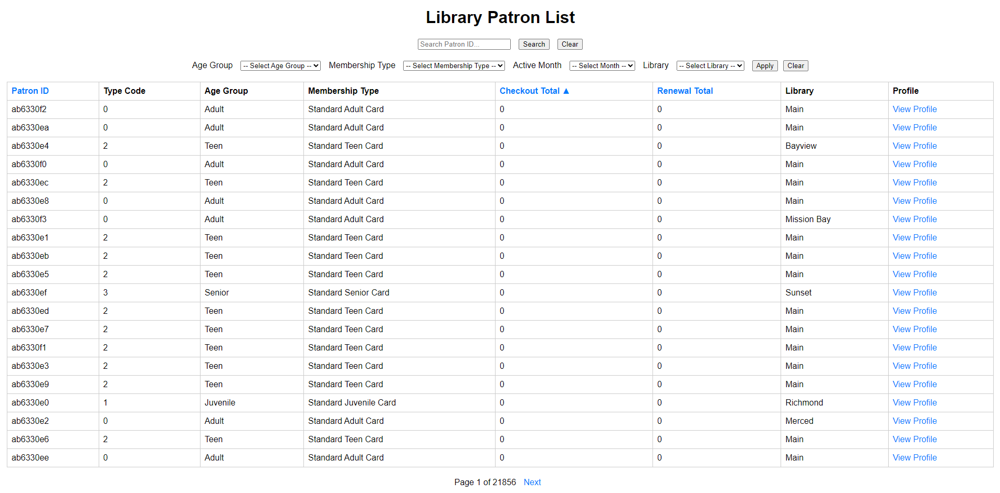
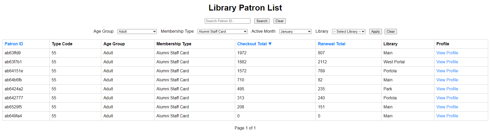
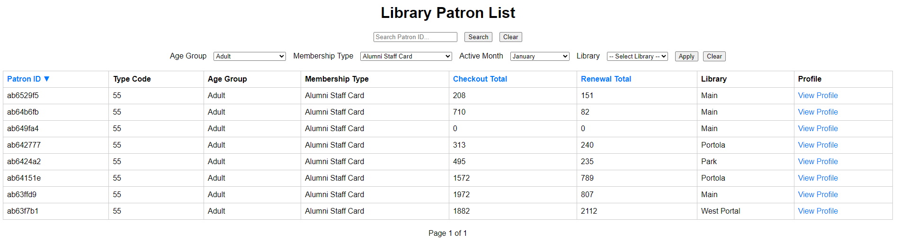
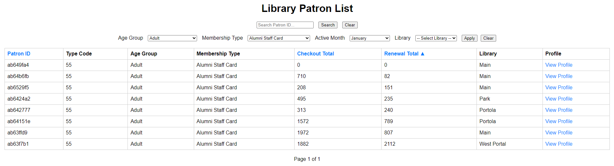
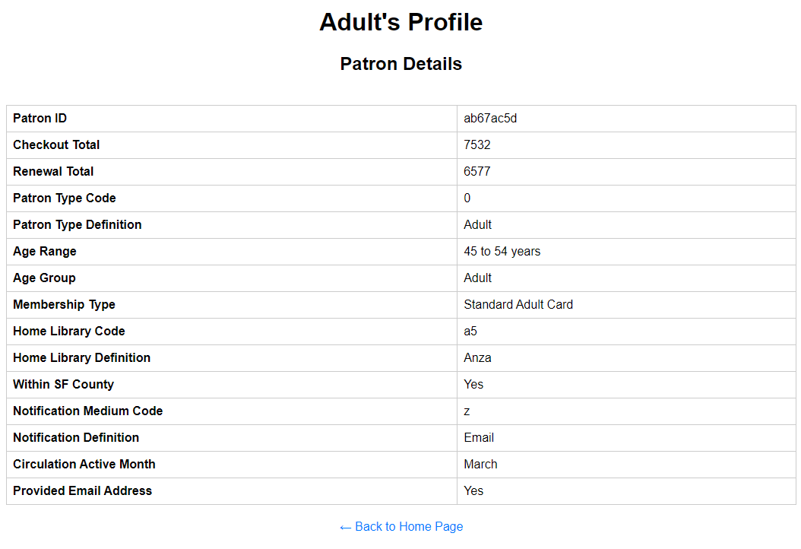

# App Description
You can search for patrons using their ID, age group, membership type, active month, or library.

# Features
You can sort patron results by ID, checkout totals, or renewal totals in ascending or descending order.

## Sorted by Descending Checkout Total

## Sorted by Descending Patron ID

## Sorted by Ascending Renewal Total

 If you use the search bar:
  - You can only search a patron's ID. This ID is from MongoDB's object ID.
  - The object ID has been shortened to the last 8 characters for easy searching.
  - To reset, press "Clear" or use the "Back to Home Page" button.

 If you use the dropdown boxes:
  - You can select your desired search query.
  - The app will return all patrons that match your selection.
      - e.g., Adult, March, Anza
  -  To reset, "Clear" or use the "Back to Home Page" button.

# Profile 
Each patron has a profile that includes the following details:
  - Patron ID
  - Checkout Total
  - Renewal Total
  - Patron Type Code
  - Patron Type Definition
  - Age Range
  - Age Group
  - Membership Type
  - Home Library Code
  - Home Library Definition
  - Within SF County (yes/no)
  - Notification Medium Code
  - Notification Definition
  - Circulation Active Month
  - Provided Email Address (yes/no)

